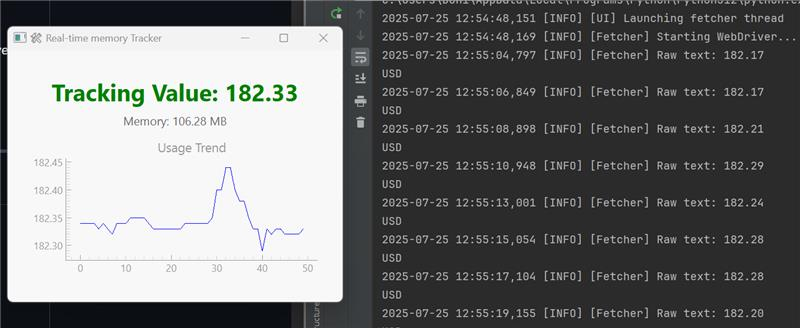
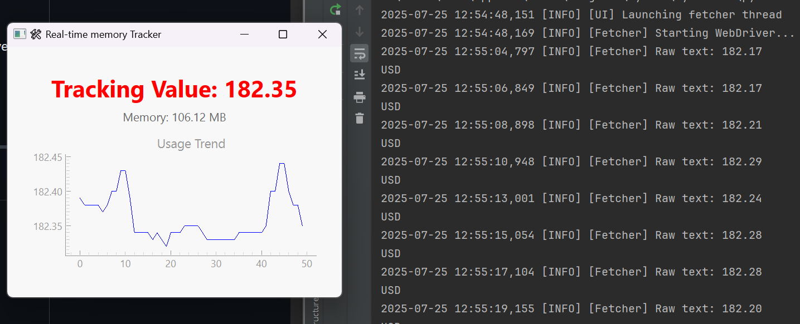
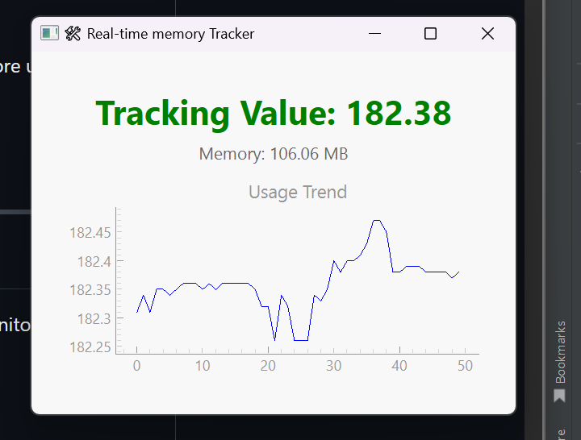
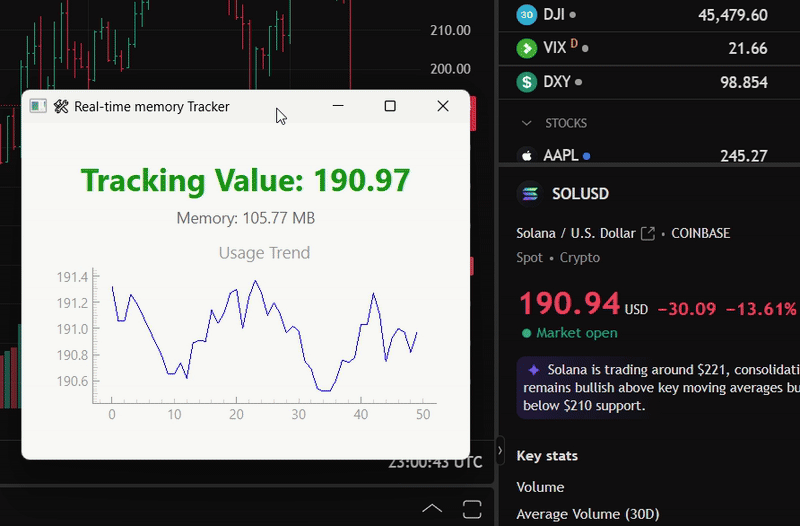

# Real-Time Coin Price Tracker  


*A sneaky little desktop app to track crypto without blowing your cover at work 👀*

<div align="">
    
    
    
</div>

Latency: ~1-3 seconds (depends on your internet and TradingView load time)

<p align="center">
  
</p>

## Why This Exists

Let’s be honest.

You’re sitting at work, you open TradingView or Binance, and suddenly:
- Your manager walks by
- Your network monitor flags “high-risk financial content” 💀
- Chrome history starts looking like your portfolio 🤡

**This app solves that.**

Just a clean, innocent desktop window showing a number and a wiggly line.  
No tabs. No suspicious site logos. No judgment. Just the price.

> 📢 We don't use any official APIs.  
> That means no limits, no tokens, and no fees.  
> Just good old browser scraping with SeleniumBase 💪


---

## Features

- ✅ Real-time coin price fetching (with anti-bot stealth mode)
- 🧠 RAM usage monitor (to prove it’s *not* mining… probably)
- 📉 Live chart so you can feel pain in real time (can turn off for more undercover)
- 🔁 Auto-refreshes if the scraping gets stuck
- 🤫 **Doesn't use any paid API — we scrape it ourselves!**
- 💸 **No tokens, no API keys, no signup – just open it and go.**

---
## Ideal Use Cases
- Your boss walks in, and you instantly alt-tab to your “memory monitor”

- You're on guest Wi-Fi and want to avoid Binance in browser

- You want clean charts without the ads, popups, or FOMO

- You’re tired of rate limits, expired keys, or overpriced API plans 😤
---

## ⚠️ DISCLAIMER
> This is for entertainment and productivity disguise only.
Use responsibly... or irresponsibly, I’m not your financial advisor.
---

## Built With

- **PyQt6** – sleek UI
- **SeleniumBase** – scrapes your coin price like a ninja
- **pyqtgraph** – makes squiggly lines go up (or down… sorry)
- **psutil** – monitors how much RAM your guilt consumes
- **pyqtgraph** – for graphs and charts

---

## Requirements

- Python 3.9+
- Chrome browser
- ChromeDriver (handled automatically by SeleniumBase)

Install the packages:

```bash
pip install -r requirements.txt
```

## How It Works
- Paste your favorite TradingView URL

- The app scrapes the current price in the background (no APIs used!)

- Shows it in big, beautiful font — with memory usage and a live chart

- Auto-refreshes the page if the price doesn’t change (no stale coins here!)

## Future (aka TODO if we feel like it)
- Add price alerts with subtle beeps (or fake Slack pings)

- Dark mode to match your soul when the market dips

- Multiple coin tracking

- CSV export (because charts are temporary, taxes are forever)